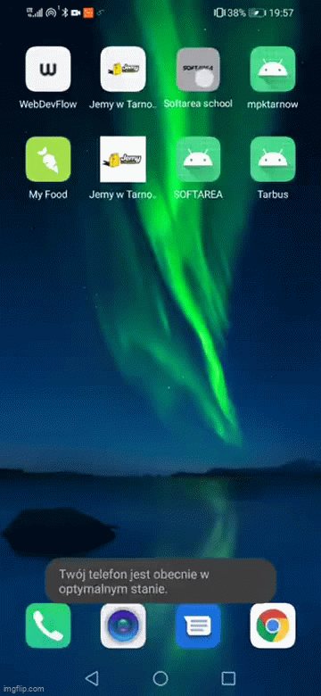

# 📖 Softarea Learning App - Internship project (2020)

## Description
An application that supports team and company management. At the moment it allows you to log into the apllication (Local database), create and delete notes.
## Technologies
This project was developed using Java (Android).

## Purpose of Publication
This codebase is published as a memento of my early days in programming. It's a snapshot of my learning journey and showcases the progress I've made since this initial foray into coding.

---

*This project is a documentation of my beginnings in the coding world and is published solely for archival purposes.*
